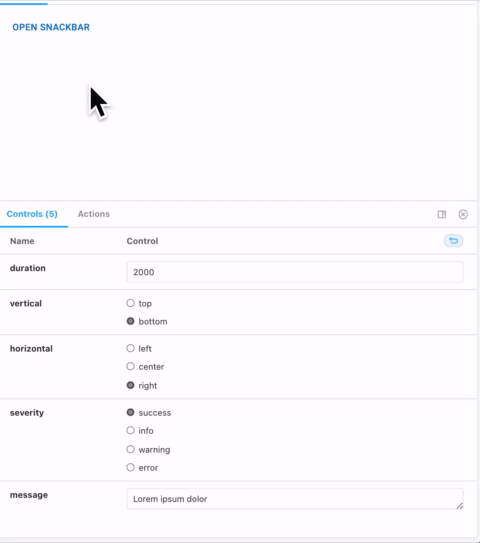

# mui-snack-stack

Shows snackbars one after the other with each disappearing after a timeout.


## Installation

```sh
npm install --save mui-snack-stack
```
or
```sh
yarn add mui-snack-stack
```
## Usage 

```javascript
import MuiSnackStack from 'mui-snack-stack';
...
```

Put `<MuiSnackStack />` in a root component.


Use `queue` from anywhere within your application to show a snackbar or queue a snackbar behind one that is already running.

```javascript
MuiSnackStack.queue(message, timeout=3000, severity='info', snackbarOrigin={vertical: 'top', horizontal: 'right'})
```

name|type
-|:-:
message|string
timeout|number
severity|'success'\|'info'\|'warning'\|'error'
snackbarOrigin|{vertical: 'top'\|'bottom; horizontal: 'left'\|'center'\|'right'}


## Single Component Example

```javascript
import MuiSnackStack from 'mui-snack-stack';
export default () => (
	<>
		<MuiSnackStack />
		<button onClick={() => MuiSnackStack.queue('Layout')}>Show Snackbar</button>
	</>
)
```
Once MuiSnackStack has been initialized, we can show snackbars from anywhere in the application.
## Multiple Components Example

```javascript
// Layout.jsx
import MuiSnackStack from 'mui-snack-stack';
import Content from './Content';
import Sidebar from './Sidebar';
export default () => (
	<>
		<MuiSnackStack />
		<Sidebar />
		<Content />
	</>
);

```
```javascript
// Content.jsx
import MuiSnackStack from 'mui-snack-stack';
export default () => (
	<button onClick={() => MuiSnackStack.queue('content')}>Show Snackbar</button>
);
```

```javascript
// Sidebar.jsx
import MuiSnackStack from 'mui-snack-stack';
export default () => (
	<button onClick={() => MuiSnackStack.queue('sidebar')}>Show Snackbar</button>
);
```


